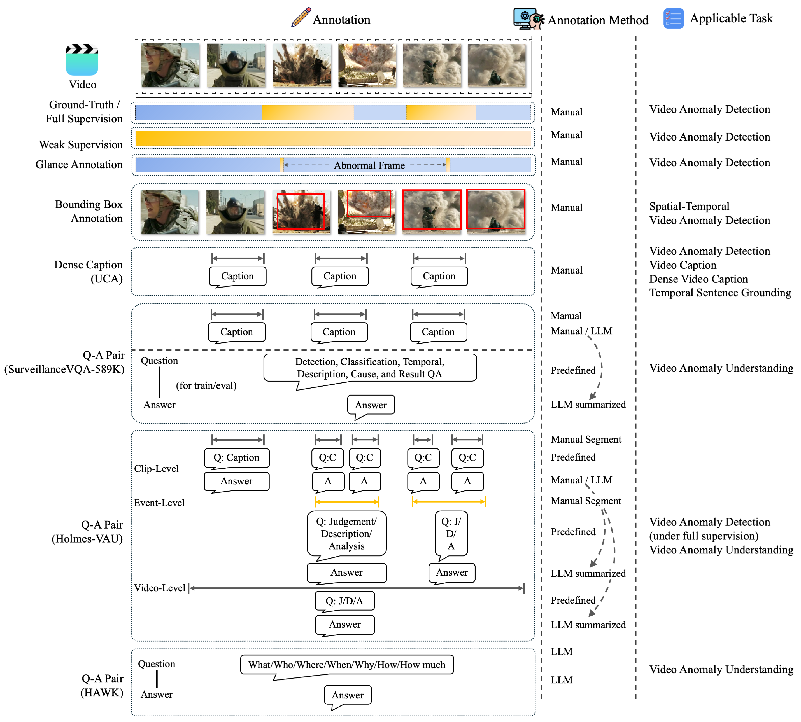

# Awesome Video Anomaly Detection

Video anomaly detection (VAD) aims to identify anomalous frames within given videos. This repository collects latest research papers, code, datasets, seminars, utilities and related resources for VAD.

If you find this repository helpful, feel free to star🌟 or share it😀! If you spot any errors, notice omissions or have any suggestions, please reach out via GitHub [issues](https://github.com/Junxi-Chen/Awesome-Video-Anomaly-Detection/issues), [pull requests](https://github.com/Junxi-Chen/Awesome-Video-Anomaly-Detection/pulls) or [email]((mailto:chenjunxi22@mails.ucas.ac.cn)).

## Contents
- [Recent Updates](#recent-updates)
- [New Setting Papers](#new-setting-papers)
- [Weakly-supervised VAD Papers](#weakly-supervised-vad-papers)
  - [Prompt Involved Papers](#prompt-involved-papers)
- [Semi-supervised VAD Papers](#semi-supervised-vad-papers)
- [Skeleton-based Papers](#skeleton-based-papers)
- [Fully-supervised VAD Papers](#fully-supervised-vad-papers)
- [Surveys](#surveys)
- [Benchmarks](#benchmarks)
- [Datasets](#datasets)
  - [Links](#links)
  - [Statistics](#statistics)
- [Seminars](#seminars)
- [Evaluation Metrics](#evaluation-metrics)
- [Utilities](#utilities)
- [Related Repositories](#related-repositories)

## Recent Updates
<!---
 &nbsp;&nbsp;&nbsp; 
-->
Last Update: May, 2025
- CVPR '25
- ICLR '25
- ACM MM '24

Related Repositories: \
<a href='#uws4vad'>uws4vad</a> 🔥🔥🔥 \
<a href='#VAD-table'>Video-Anomaly-Detection</a>

Papers: \
<a href='#VANE-Bench'>VANE-Bench</a> \
<a href='#Sherlock'>Sherlock</a> \
<a href='#SurveillanceVQA-589K'>SurveillanceVQA-589K</a> \
<a href='#Holmes-VAU'>Holmes-VAU</a> \
<a href='#HAWK'>HAWK</a> \
<a href='#UCA'>UCA</a> \
<a href='#GlanceVAD'>GlanceVAD</a> \
<a href='#UCF-Crime-DVS'>UCF-Crime-DVS</a> \
<a href='#GiCiSAD'>GiCiSAD</a> \
<a href='#PoseWatch'>PoseWatch</a> \
<a href='#DA-Flow'>DA-Flow</a> \
<a href='#MoCoDAD'>MoCoDAD</a>

## New Setting Papers
1. [VANE-Bench] **VANE-Bench: Video Anomaly Evaluation Benchmark for Conversational LMMs** &nbsp;&nbsp;&nbsp;\
  \
NAACL '25 [[paper](https://arxiv.org/pdf/2406.10326)][[code](https://github.com/rohit901/VANE-Bench)][[dataset](https://huggingface.co/datasets/rohit901/VANE-Bench)][[project](https://hananshafi.github.io/vane-benchmark/)]

1. [Sherlock] **Sherlock: Towards Multi-scene Video Abnormal Event Extraction and Localization via a Global-local Spatial-sensitive LLM** &nbsp;&nbsp;&nbsp;\
  \
WWW '25 [[paper](https://arxiv.org/pdf/2502.18863)][[OpenReview](https://openreview.net/forum?id=YHW5w2hZcZ#discussion)]

1. [SurveillanceVQA-589K] **SurveillanceVQA-589K: A Benchmark for
Comprehensive Surveillance Video-Language
Understanding with Large Models** &nbsp;&nbsp;&nbsp;\
  \
arXiv '25 [[paper](https://arxiv.org/pdf/2505.12589)][[annotation](https://huggingface.co/datasets/fei213/SurveillanceVQA-589K)]

1. [Holmes-VAU] **Holmes-VAU: Towards Long-term Video Anomaly Understanding at Any Granularity** &nbsp;&nbsp;&nbsp;\
  \
CVPR '25 [[paper](https://arxiv.org/pdf/2412.06171)][[code & annotation](https://github.com/pipixin321/HolmesVAU)]

1. [HAWK] **HAWK: Learning to Understand Open-World Video Anomalies** &nbsp;&nbsp;&nbsp; \
  \
NeurIPS '24 [[paper](https://github.com/jqtangust/hawk)][[code](https://github.com/jqtangust/hawk)][[annotation](https://drive.google.com/file/d/1WCnizldWZvtS4Yg5SX7ay5C3kUQfz-Eg/view)]

1. [VAR] **Toward Video Anomaly Retrieval From Video Anomaly Detection: New Benchmarks and Model**\

 \
TIP '24 [[paper](https://ieeexplore.ieee.org/document/10471334/)][[dataset](https://github.com/Roc-Ng/VAR)]

1. [AnomalyRuler] **Follow the Rules: Reasoning for Video Anomaly Detection with Large Language Models** \
\
ECCV '24 [[paper](https://www.ecva.net/papers/eccv_2024/papers_ECCV/papers/10568.pdf)][[code](https://github.com/Yuchen413/AnomalyRuler)]

1. [UCA] **Towards Surveillance Video-and-Language Understanding: New Dataset,
Baselines, and Challenges** &nbsp;&nbsp;&nbsp;  \
CVPR '24 [[paper](https://openaccess.thecvf.com/content/CVPR2024/papers/Yuan_Towards_Surveillance_Video-and-Language_Understanding_New_Dataset_Baselines_and_Challenges_CVPR_2024_paper.pdf)][[code & annotation](https://github.com/Xuange923/Surveillance-Video-Understanding)][[project](https://xuange923.github.io/Surveillance-Video-Understanding)]

1. [GlanceVAD] **GlanceVAD: Exploring Glance Supervision for Label-efficient Video Anomaly Detection** &nbsp;&nbsp;&nbsp; \
  \
ICME '25 [[paper](https://arxiv.org/pdf/2403.06154)][[code & annotation](https://github.com/pipixin321/GlanceVAD)]

1. [OVVAD] **Open-Vocabulary Video Anomaly Detection** \

\
CVPR '24 [[paper](https://openaccess.thecvf.com/content/CVPR2024/papers/Wu_Open-Vocabulary_Video_Anomaly_Detection_CVPR_2024_paper.pdf)][[supp](https://openaccess.thecvf.com/content/CVPR2024/supplemental/Wu_Open-Vocabulary_Video_Anomaly_CVPR_2024_supplemental.pdf)]

1. [LAVAD] **Harnessing Large Language Models for Training-free Video Anomaly Detection** \
\
CVPR '24 [[paper](https://openaccess.thecvf.com/content/CVPR2024/papers/Zanella_Harnessing_Large_Language_Models_for_Training-free_Video_Anomaly_Detection_CVPR_2024_paper.pdf)][[code](https://github.com/lucazanella/lavad)][[supp](https://openaccess.thecvf.com/content/CVPR2024/supplemental/Zanella_Harnessing_Large_Language_CVPR_2024_supplemental.pdf)]

1. [CUVA] **Uncovering What, Why and How:  A Comprehensive Benchmark for Causation Understanding of Video Anomaly** \
  \
CVPR '24 [[paper](https://openaccess.thecvf.com/content/CVPR2024/papers/Du_Uncovering_What_Why_and_How_A_Comprehensive_Benchmark_for_Causation_CVPR_2024_paper.pdf)][[code & dataset](https://github.com/fesvhtr/CUVA)][[supp](https://openaccess.thecvf.com/content/CVPR2024/html/Du_Uncovering_What_Why_and_How_A_Comprehensive_Benchmark_for_Causation_CVPR_2024_paper.html)]

1. [UCF-Crime-DVS] **UCF-Crime-DVS: A Novel Event-Based Dataset for Video Anomaly Detection with Spiking Neural** &nbsp;&nbsp;&nbsp;\
 \
[[paper](https://arxiv.org/pdf/2503.12905v1)][[code & dataset](https://github.com/YBQian-Roy/UCF-Crime-DVS)]

1. [TDSD] **TDSD: Text-Driven Scene-Decoupled Weakly Supervised Video Anomaly Detection**  \

 \
ACM MM '24 [[paper](https://openreview.net/pdf?id=TAVtkpjS9P)][[code](https://github.com/shengyangsun/TDSD)][[OpenReview](https://openreview.net/forum?id=TAVtkpjS9P&noteId=TAVtkpjS9P)]

## Weakly-supervised VAD Papers
1. [CDL] **Cross-Domain Learning for Video Anomaly Detection with Limited Supervision** \

\
ECCV '24 [[paper](https://www.ecva.net/papers/eccv_2024/papers_ECCV/papers/04459.pdf)]

1. [HLGAtt] **Cross-Modal Fusion and Attention Mechanism for Weakly Supervised Video Anomaly Detection**  \

\
CVPR '24 Workshop [[paper](https://openaccess.thecvf.com/content/CVPR2024W/MULA/papers/Ghadiya_Cross-Modal_Fusion_and_Attention_Mechanism_for_Weakly_Supervised_Video_Anomaly_CVPRW_2024_paper.pdf)] 

1. [STPrompt] **Weakly Supervised Video Anomaly Detection and Localization with Spatio-Temporal Prompts**  \

\
ACM MM '24 [[paper](https://arxiv.org/pdf/2408.05905)][[OpenReview](https://openreview.net/forum?id=2es1ojI14x&referrer=%5Bthe%20profile%20of%20Peng%20Wu%5D(%2Fprofile%3Fid%3D~Peng_Wu2))]

1. [ECU] **Exploiting Completeness and Uncertainty of Pseudo Labels for Weakly Supervised Video Anomaly Detection** \
\
CVPR '23 [[paper](https://openaccess.thecvf.com/content/CVPR2023/papers/Zhang_Exploiting_Completeness_and_Uncertainty_of_Pseudo_Labels_for_Weakly_Supervised_CVPR_2023_paper.pdf)][[code](https://github.com/ArielZc/CU-Net)][[supp](https://openaccess.thecvf.com/content/CVPR2023/supplemental/Zhang_Exploiting_Completeness_and_CVPR_2023_supplemental.pdf)]

1. [CoMo] **Look Around for Anomalies: Weakly-supervised Anomaly Detection via Context-Motion Relational Learning**  \
\
CVPR '23 [[paper](https://openaccess.thecvf.com/content/CVPR2023/papers/Cho_Look_Around_for_Anomalies_Weakly-Supervised_Anomaly_Detection_via_Context-Motion_Relational_CVPR_2023_paper.pdf)][[supp](https://openaccess.thecvf.com/content/CVPR2023/supplemental/Cho_Look_Around_for_CVPR_2023_supplemental.pdf)]

1. [ADGCN] **Graph Convolutional Label Noise Cleaner: Train a Plug-and-play Action Classifier for Anomaly Detection** \
CVPR 19' [[paper](https://openaccess.thecvf.com/content_CVPR_2019/papers/Zhong_Graph_Convolutional_Label_Noise_Cleaner_Train_a_Plug-And-Play_Action_Classifier_CVPR_2019_paper.pdf)][[code](https://github.com/jx-zhong-for-academic-purpose/GCN-Anomaly-Detection)]

### Prompt Involved Papers
1. [Vadclip] **Vadclip: Adapting vision-language models for weakly supervised video anomaly detection**  \

\
AAAI '24 [[paper](https://ojs.aaai.org/index.php/AAAI/article/download/28423/28826)][[code](https://github.com/nwpu-zxr/VadCLIP)] 

1. [PE-MIL] **Prompt-Enhanced Multiple Instance Learning for Weakly Supervised Video Anomaly Detection**  \

\
CVPR '24 [[paper](https://openaccess.thecvf.com/content/CVPR2024/papers/Chen_Prompt-Enhanced_Multiple_Instance_Learning_for_Weakly_Supervised_Video_Anomaly_Detection_CVPR_2024_paper.pdf)][[code](https://github.com/Junxi-Chen/PE-MIL)][[supp](https://openaccess.thecvf.com/content/CVPR2024/supplemental/Chen_Prompt-Enhanced_Multiple_Instance_CVPR_2024_supplemental.pdf)]

1. [TPWNG] **Text Prompt with Normality Guidance for Weakly Supervised Video Anomaly Detection** \

\
CVPR '24 [[paper](https://openaccess.thecvf.com/content/CVPR2024/papers/Yang_Text_Prompt_with_Normality_Guidance_for_Weakly_Supervised_Video_Anomaly_CVPR_2024_paper.pdf)][[supp](https://openaccess.thecvf.com/content/CVPR2024/supplemental/Yang_Text_Prompt_with_CVPR_2024_supplemental.pdf)]

## Semi-supervised VAD Papers

1. [LPGB] **Local Patterns Generalize Better for Novel Anomalies** \
ICLR '25 [[paper](https://openreview.net/pdf?id=4ua4wyAQLm)][[code](https://github.com/AllenYLJiang/Local-Patterns-Generalize-Better/)][[OpenReview](https://openreview.net/forum?id=4ua4wyAQLm)]

1. [LANP] **Learning Anomalies with Normality Prior for Unsupervised Video Anomaly Detection**  \
\
ECCV '24 [[paper](https://www.ecva.net/papers/eccv_2024/papers_ECCV/papers/00941.pdf)] 

1. [Joint-VAD] **Interleaving One-Class and Weakly-Supervised Models with Adaptive Thresholding for Unsupervised Video Anomaly Detection** \
\
ECCV '24 [[paper](https://www.ecva.net/papers/eccv_2024/papers_ECCV/papers/04450.pdf)][[code](https://github.com/benedictstar/Joint-VAD)]

1. [SSAE] **Scene-Dependent Prediction in Latent Space for Video Anomaly Detection and Anticipation**  \
T-PAMI '24[[paper](https://ieeexplore.ieee.org/abstract/document/10681297/)][[project](https://campusvaa.github.io)][[code](https://github.com/zugexiaodui/campus_vad_code)][[dataset](https://drive.google.com/drive/folders/1_EztmkNpTPyVb4lM0m4rLTXgXo_LzgF1?usp=share_link)]

1. [DoTA] **DoTA: Unsupervised Detection of Traffic Anomaly in Driving Videos** \
T-PAMI '23 [[paper](https://ieeexplore.ieee.org/document/9712446/)][[code](https://github.com/MoonBlvd/Detection-of-Traffic-Anomaly)][[dataset](https://drive.google.com/drive/folders/1_WzhwZC2NIpzZIpX7YCvapq66rtBc67n)]

1. [AED-MAE] **Self-Distilled Masked Auto-Encoders are Efficient Video Anomaly Detectors**  \
CVPR '24 [[paper](https://openaccess.thecvf.com/content/CVPR2024/papers/Ristea_Self-Distilled_Masked_Auto-Encoders_are_Efficient_Video_Anomaly_Detectors_CVPR_2024_paper.pdf)][[code](https://github.com/ristea/aed-mae/tree/main)][[supp](https://openaccess.thecvf.com/content/CVPR2024/supplemental/Ristea_Self-Distilled_Masked_Auto-Encoders_CVPR_2024_supplemental.pdf)]

1. [MSTL] **Multi-Scale Video Anomaly Detection by Multi-Grained Spatio-Temporal  Representation Learning**  \
 \
CVPR '24 [[paper](https://openaccess.thecvf.com/content/CVPR2024/papers/Zhang_Multi-Scale_Video_Anomaly_Detection_by_Multi-Grained_Spatio-Temporal_Representation_Learning_CVPR_2024_paper.pdf)][[supp](https://openaccess.thecvf.com/content/CVPR2024/supplemental/Zhang_Multi-Scale_Video_Anomaly_CVPR_2024_supplemental.pdf)]

1. [MULDE] **MULDE: Multiscale Log-Density Estimation via Denoising Score Matching for  Video Anomaly Detection**  \
  \
CVPR '24 [[paper](https://openaccess.thecvf.com/content/CVPR2024/papers/Micorek_MULDE_Multiscale_Log-Density_Estimation_via_Denoising_Score_Matching_for_Video_CVPR_2024_paper.pdf)][[code](https://github.com/jakubmicorek/MULDE-Multiscale-Log-Density-Estimation-via-Denoising-Score-Matching-for-Video-Anomaly-Detection)][[supp](https://openaccess.thecvf.com/content/CVPR2024/supplemental/Micorek_MULDE_Multiscale_Log-Density_CVPR_2024_supplemental.pdf)]

1. [CLAP] **Collaborative Learning of Anomalies with Privacy (CLAP) for Unsupervised Video Anomaly Detection: A New Baseline** \
CVPR '24 [[paper](https://openaccess.thecvf.com/content/CVPR2024/papers/Al-lahham_Collaborative_Learning_of_Anomalies_with_Privacy_CLAP_for_Unsupervised_Video_CVPR_2024_paper.pdf)][[code](https://github.com/AnasEmad11/CLAP)][[supp](https://openaccess.thecvf.com/content/CVPR2024/supplemental/Al-lahham_Collaborative_Learning_of_CVPR_2024_supplemental.pdf)]

1. [MGENet] **A Multilevel Guidance-Exploration Network and Behavior-Scene Matching Method for Human Behavior Anomaly Detection**   \
\
ACM MM '24 [[paper](https://openreview.net/pdf?id=g7zkmttvJp)][[code](https://github.com/molu-ggg/GENet)][[OpenReview](https://openreview.net/forum?id=g7zkmttvJp)]

1. [MPT] **Video Anomaly Detection via Progressive Learning of Multiple Proxy Tasks**  \
ACM MM '24 [[paper](https://openreview.net/pdf?id=WsNFULCsyj)][[OpenReview](https://openreview.net/forum?id=WsNFULCsyj&referrer=%5Bthe%20profile%20of%20Lei%20Zhang%5D(%2Fprofile%3Fid%3D~Lei_Zhang67))]

## Skeleton-based Papers
1. [GiCiSAD] **Graph-Jigsaw Conditioned Diffusion Model for Skeleton-based Video Anomaly Detection** &nbsp;&nbsp;&nbsp; \
WACV '25 [[paper](https://arxiv.org/pdf/2403.12172)][[code](https://github.com/karami7899/Graph-Jigsaw-Conditioned-Diffusion-Model-for-Skeleton-based-Video-Anomaly-Detection)]

2. [PoseWatch] **PoseWatch: A Transformer-based Architecture for Human-centric Video Anomaly Detection Using Spatio-temporal Pose Tokenization** &nbsp;&nbsp;&nbsp; \
arXiv '25 [[paper](https://arxiv.org/pdf/2408.15185)][[code](https://github.com/TeCSAR-UNCC/SPARTA)]

1. [DA-Flow] **DA-Flow: Dual Attention Normalizing Flow for
Skeleton-based Video Anomaly Detection** &nbsp;&nbsp;&nbsp; \
arXiv '24 [[paper](https://arxiv.org/pdf/2406.02976)]

1. [MoCoDAD] **Multimodal Motion Conditioned Diffusion Model for Skeleton-based Video Anomaly Detection** &nbsp;&nbsp;&nbsp; \
ICCV '23 [[paper](https://openaccess.thecvf.com/content/ICCV2023/papers/Flaborea_Multimodal_Motion_Conditioned_Diffusion_Model_for_Skeleton-based_Video_Anomaly_Detection_ICCV_2023_paper.pdf)][[code](https://github.com/aleflabo/MoCoDAD)][[supp](https://openaccess.thecvf.com/content/ICCV2023/supplemental/Flaborea_Multimodal_Motion_Conditioned_ICCV_2023_supplemental.pdf)]

## Fully-supervised VAD Papers
1. [EBB] **Exploring Background-bias for Anomaly Detection in Surveillance Videos** \
ACM MM 19' [[paper](https://dl.acm.org/doi/abs/10.1145/3343031.3350998)][[annotation](https://github.com/xuzero/UCFCrime_BoundingBox_Annotation)]

1. [ALVS] **ANOMALY LOCALITY IN VIDEO SURVEILLANCE** \
arXiv 19' [[paper](https://arxiv.org/pdf/1901.10364)][[project](https://aimagelab.ing.unimore.it/imagelab/page.asp?IdPage=30)][[annotation](https://drive.google.com/drive/folders/1Hu2oke7acBqcKKyUpv5NBmQ2fDiYn87c)]

## Surveys
1. [MSAD] **Advancing Video Anomaly Detection: A Concise Review and a New Dataset**  \
NeurIPS '24 [[paper](https://papers.nips.cc/paper_files/paper/2024/file/a3c5af1f56fc73eef1ba0f442739f5ca-Paper-Datasets_and_Benchmarks_Track.pdf)][[project](https://msad-dataset.github.io)]

1. [BenchmarkReview] **Unveiling the performance of video anomaly detection models — A benchmark-based review**  \
Intelligent Systems with Applications '23 [[paper](https://www.sciencedirect.com/science/article/pii/S2667305323000613)] 

1. [WVAD-Review] **Weakly Supervised Anomaly Detection: A Survey** \
arXiv '23 [[paper](https://arxiv.org/pdf/2302.04549)][[repo](https://github.com/yzhao062/wsad)]

1. [VAD-10] **Video Anomaly Detection in 10 Years: A Survey and Outlook** \
arXiv '24 [[paper](https://arxiv.org/abs/2405.19387)]

1. [GNN4TS] **A Survey on Graph Neural Networks for Time Series: Forecasting, Classification, Imputation, and Anomaly Detection** \
T-PAMI '24 [[paper](https://github.com/KimMeen/Awesome-GNN4TS)][[repo](https://github.com/KimMeen/Awesome-GNN4TS)]

1. [GTCNN] **Graph-Time Convolutional Neural Networks: Architecture and Theoretical Analysis** \
T-PAMI '23 [[paper](https://ieeexplore.ieee.org/abstract/document/10239277)]

## Benchmarks
<table>
  <tr>
    <th></th>
     <th>Method</th>
     <th>Publication</th>
     <th>Visual Features</th>
     <th>STC (AUC)</th>
     <th>UCF (AUC)</th>
     <th>XDV (AP)</th>
     <th>Ave (AUC)</th>
     <th>Cor (AUC)</th>
     <th>UBnormal (AUC)</th>
     <th>Ped2 (AUC)</th>
     <th>Campus (AUC)</th>
     <th>NWPU (AUC)</th>
     <th>NPDI (AUC)</th>
     <th>TAD (AUC)</th>
     <th>Audio Features</th>
     <th>Text Prompt</th>
     <th>LLM Involved</th>
     <th>Data Augumentation</th>
  </tr>
  <tr>
    <td rowspan="8">Semi-supervised</td>
    <td rowspan="2"><a href="#LANP">LANP</a></td>
    <td rowspan="2">ECCV '24</td>
    <td>I3D</td>
    <td>88.32</td>
    <td>80.02</td>
    <td rowspan="2"> - </td>
    <td rowspan="2"> - </td>
    <td rowspan="2"> - </td>
    <td rowspan="2"> - </td>
    <td rowspan="2"> - </td>
    <td rowspan="2"> - </td>
    <td rowspan="2"> - </td>
    <td rowspan="2"> - </td>
    <td rowspan="2"> - </td>
    <td rowspan="2"> - </td>
    <td rowspan="2"> - </td>
    <td rowspan="2"> - </td>
    <td rowspan="2"> - </td>
  </tr>
  <tr>
    <td>ResNext</td>
    <td>86.46</td>
    <td>76.64</td>
  </tr>
  <tr>
    <td><a href="#SSAE">SSAE</a></td>
    <td>T-PAMI '24</td>
    <td> - </td>
    <td>80.5</td>
    <td> - </td>
    <td> - </td>
    <td>90.2</td>
    <td>75.8</td>
    <td> - </td>
    <td> - </td>
    <td> - </td>
    <td>75.6</td>
    <td> - </td>
    <td> - </td>
    <td> - </td>
    <td> - </td>
    <td> - </td>
    <td> - </td>
  </tr>
  <tr>
    <td><a href="#AED-MAE">AED-MAE</a></td>
    <td>CVPR '24</td>
    <td> - </td>
    <td>79.1</td>
    <td> - </td>
    <td> - </td>
    <td>91.3</td>
    <td> - </td>
    <td>58.5</td>
    <td>95.4</td>
    <td> - </td>
    <td> - </td>
    <td> - </td>
    <td> - </td>
    <td> - </td>
    <td> - </td>
    <td> - </td>
    <td> - </td>
  </tr>
  <tr>
    <td><a href="#Zhang-CVPR24">MSTL</a></td>
    <td>CVPR '24</td>
    <td>I3D</td>
    <td> 87.5 </td>
    <td> 80.6 </td>
    <td> - </td>
    <td> 94.3 </td>
    <td> - </td>
    <td> - </td>
    <td> - </td>
    <td> 70.1 </td>
    <td> - </td>
    <td> - </td>
    <td> - </td>
    <td> - </td>
    <td> - </td>
    <td> - </td>
    <td> - </td>
  </tr>
  <tr>
    <td><a href='#MULDE'>MULDE</a></td>
    <td>CVPR '24</td>
    <td>CLIP+Hiera</td>
    <td>81.3</td>
    <td>78.5</td>
    <td> - </td>
    <td> - </td>
    <td> - </td>
    <td>72.8</td>
    <td> - </td>
    <td> - </td>
    <td> - </td>
    <td> - </td>
    <td> - </td>
    <td> - </td>
    <td> - </td>
    <td> - </td>
    <td> - </td>
  </tr>
  <tr>
    <td><a href='#MGENet'>MGEnet</a></td>
    <td>MM '24</td>
    <td>Video Swin</td>
    <td>86.9</td>
    <td> - </td>
    <td> - </td>
    <td> - </td>
    <td> - </td>
    <td> 74.3 </td>
    <td> - </td>
    <td> - </td>
    <td> - </td>
    <td> - </td>
    <td> - </td>
    <td> - </td>
    <td> - </td>
    <td> - </td>
    <td> - </td>
  </tr>
  <tr>
    <td><a href='#Zhang-MM'24>MPT</a></td>
    <td>MM '24</td>
    <td> - </td>
    <td>88.6</td>
    <td>83.2</td>
    <td> - </td>
    <td> 94.5 </td>
    <td> - </td>
    <td> - </td>
    <td> - </td>
    <td> - </td>
    <td> - </td>
    <td> - </td>
    <td> - </td>
    <td> - </td>
    <td> - </td>
    <td> - </td>
    <td> - </td>
  </tr>
  <tr>
    <th colspan="19"></th>
  </tr>
  <tr>
    <td rowspan="8">Weakly-supervised</td>
    <td><a href='#HLGAtt'>HLGAtt</a></td>
    <td>CVPR '24 Workshop</td>
    <td>I3D</td>
    <td> - </td>
    <td> - </td>
    <td> 86.34 </td>
    <td> - </td>
    <td> - </td>
    <td> - </td>
    <td> - </td>
    <td> - </td>
    <td> - </td>
    <td> 99.45 </td>
    <td> - </td>
    <td> VGGish </td>
    <td> - </td>
    <td> - </td>
    <td> - </td>
  </tr>
  <tr>
    <td><a href='#STPrompt'>STPrompt</a></td>
    <td>MM '24</td>
    <td>CLIP</td>
    <td> 97.81 </td>
    <td> 88.08 </td>
    <td> - </td>
    <td> - </td>
    <td> - </td>
    <td> 63.98 </td>
    <td> - </td>
    <td> - </td>
    <td> - </td>
    <td> - </td>
    <td> - </td>
    <td> - </td>
    <td> &#10004; </td>
    <td> - </td>
    <td> - </td>
  </tr>
  <tr>
    <td><a href='#ECU'>ECU</a></td>
    <td>CVPR '23</td>
    <td>I3D</td>
    <td> - </td>
    <td> 86.22 </td>
    <td> 81.43 </td>
    <td> - </td>
    <td> - </td>
    <td> - </td>
    <td> - </td>
    <td> - </td>
    <td> - </td>
    <td> - </td>
    <td> 91.66 </td>
    <td> VGGish </td>
    <td> - </td>
    <td> - </td>
    <td> - </td>
  </tr>
  <tr>
    <td><a href='#CoMo'>CoMo</a></td>
    <td>CVPR '23</td>
    <td>I3D</td>
    <td>97.6</td>
    <td>86.1</td>
    <td>81.3</td>
    <td>89.8</td>
    <td> - </td>
    <td> - </td>
    <td> - </td>
    <td> - </td>
    <td> - </td>
    <td> - </td>
    <td> - </td>
    <td> - </td>
    <td> - </td>
    <td> - </td>
    <td> - </td>
  </tr>
  <tr>
    <td><a href='#Vadclip'>Vadclip</a></td>
    <td>AAAI '24</td>
    <td>CLIP</td>
    <td> - </td>
    <td> 88.02 </td>
    <td> 84.51 </td>
    <td> - </td>
    <td> - </td>
    <td> - </td>
    <td> - </td>
    <td> - </td>
    <td> - </td>
    <td> - </td>
    <td> - </td>
    <td> - </td>
    <td> &#10004; </td>
    <td> - </td>
    <td> - </td>
  </tr>
  <tr>
    <td><a href='#PE-MIL'>PE-MIL</a></td>
    <td>CVPR '24</td>
    <td>I3D</td>
    <td> 98.35 </td>
    <td> 86.83 </td>
    <td> 88.21 </td>
    <td> - </td>
    <td> - </td>
    <td> - </td>
    <td> - </td>
    <td> - </td>
    <td> - </td>
    <td> - </td>
    <td> - </td>
    <td> VGGish </td>
    <td> &#10004; </td>
    <td> - </td>
    <td> - </td>
  </tr>
</table>

## Datasets

### Links
| Dataset | Download Links | Features | Additional Annotations | Publication |
|:-----------|:------------|:------------|:------------|:------------|
| [ShanghaiTech Campus](https://svip-lab.github.io/dataset/campus_dataset.html)      | [BaiduYun](https://pan.baidu.com/s/1W3_tkiiNHKd_4uQ2tgBq8g?pwd=3mh5)        |[I3D](https://drive.google.com/file/d/1kIv502RxQnMer-8HB7zrU_GU7CNPNNDv/view?usp=drive_link) | - |[CVPR 18'](https://openaccess.thecvf.com/content_cvpr_2018/papers/Liu_Future_Frame_Prediction_CVPR_2018_paper.pdf)       |
| [UCF-Crime](https://www.crcv.ucf.edu/projects/real-world/)      | [Dropbox](https://www.dropbox.com/scl/fo/2aczdnx37hxvcfdo4rq4q/AOjRokSTaiKxXmgUyqdcI6k?rlkey=5bg7mxxbq46t7aujfch46dlvz&e=1&dl=0) |  [I3D](https://stuxidianeducn-my.sharepoint.com/:f:/g/personal/pengwu_stu_xidian_edu_cn/EvYcZ5rQZClGs_no2g-B0jcB4ynsonVQIreHIojNnUmPyA?e=xNrGxc)     |  [Full Annotation & Bounding Box Annotation](https://github.com/xuzero/UCFCrime_BoundingBox_Annotation) | [CVPR 18'](https://openaccess.thecvf.com/content_cvpr_2018/papers/Sultani_Real-World_Anomaly_Detection_CVPR_2018_paper.pdf)       |
| [XD-Violence](https://roc-ng.github.io/XD-Violence/) | [OneDrive](https://roc-ng.github.io/XD-Violence/) | [I3D & VGGish](https://roc-ng.github.io/XD-Violence/)| - | [ECCV 20'](https://arxiv.org/pdf/2007.04687)|
| [NWPU Campus](https://campusvaa.github.io) | [BaiduYun](https://pan.baidu.com/share/init?surl=mhhxdYYKYZsWBO36NX655g&pwd=il54) & [Google Drive](https://drive.google.com/drive/folders/1_EztmkNpTPyVb4lM0m4rLTXgXo_LzgF1?usp=share_link) | - | - | [CVPR '23](https://openaccess.thecvf.com/content/CVPR2023/papers/Cao_A_New_Comprehensive_Benchmark_for_Semi-Supervised_Video_Anomaly_Detection_and_CVPR_2023_paper.pdf) & [T-PAMI '24](https://ieeexplore.ieee.org/abstract/document/10681297/) |
| [UBnormal](https://github.com/lilygeorgescu/UBnormal/) | [GoogleDrive](https://drive.google.com/file/d/1KbfdyasribAMbbKoBU1iywAhtoAt9QI0/view) | - | &#x2611; | [CVPR '22](https://openaccess.thecvf.com/content/CVPR2022/papers/Acsintoae_UBnormal_New_Benchmark_for_Supervised_Open-Set_Video_Anomaly_Detection_CVPR_2022_paper.pdf)
| [ECVA](https://github.com/Dulpy/ECVA) | [ModelScope](https://www.modelscope.cn/datasets/gouchenyi/ECVA/files) | - | - | [CVPR '24](https://arxiv.org/pdf/2412.07183) |
| [MSAD](https://msad-dataset.github.io) | [Request Form](https://forms.microsoft.com/pages/responsepage.aspx?id=XHJ941yrJEaa5fBTPkhkN0_bcDHlPvFAiLdm3BQe86NURVI5RlRWODhYWVZYSzNCSlBROThBTEQzOC4u&route=shorturl) | [Swin & I3D](https://drive.google.com/drive/folders/1mxFGCcAuEecN0c7MHD12wD4pO2Ej5kLe) | - | [NeurIPS '24](https://papers.nips.cc/paper_files/paper/2024/file/a3c5af1f56fc73eef1ba0f442739f5ca-Paper-Datasets_and_Benchmarks_Track.pdf) |
| [TAD](https://github.com/ktr-hubrt/WSAL?tab=readme-ov-file) | [GoogleDrive](https://drive.google.com/drive/folders/1cofMJGglil4vddrq_unuy7EEhthMYtuq) | - | - | [TIP '21](https://ieeexplore.ieee.org/abstract/document/9408419/) |
| NPDI | [Contact Email](mailto:sandra@ic.unicamp.br) | - | - | [CVIU 13'](https://www.sciencedirect.com/science/article/abs/pii/S1077314212001737) |
| Pornography-2k | [Contact Email](mailto:anderson.rocha@gmail.com) | - | - | [FSI 16'](https://www.sciencedirect.com/science/article/abs/pii/S0379073816304169) |

### Statistics
<table>
    <tr>
        <th>Dataset</th>
        <th>&nbsp;&nbsp;&nbsp;&nbsp;&nbsp;Citations&nbsp;&nbsp;&nbsp;&nbsp;&nbsp;</th>
        <th>Year</th>
        <th>Source</th>
        <th>Domain</th>
        <th>Modality</th>
        <th>#Videos</th>
        <th>Supervision</th>
        <th>#Training Abnormal Videos</th>
        <th>#Training Normal Videos</th>
        <th>#Test Abnormal Videos</th>
        <th>#Test Normal Videos</th>
        <th>#Validation Normal Videos</th>
        <th>#Validation Normal Videos</th>
        <th>#Anomaly Types</th>
    </tr>
    <tr>
        <td rowspan="2">ShanghaiTech</td>
        <td rowspan="2">  </td>
        <td rowspan="2">2018</td>
        <td rowspan="2">Surveillance</td>
        <td rowspan="2">Campus</td>
        <td rowspan="2">Visual</td>
        <td rowspan="2">437</td>
        <td>Semi</td>
        <td>-</td>
        <td>330</td>
        <td>107</td>
        <td>-</td>
        <td rowspan="2">-</td>
        <td rowspan="2">-</td>
        <td rowspan="2">13</td>
    </tr>
    <tr>
        <td>Weakly*</td>
        <td>63</td>
        <td>175</td>
        <td>44</td>
        <td>155</td>
    </tr>
    <tr>
        <td rowspan="2">UCF-Crime</td>
        <td rowspan="2">  </td>
        <td rowspan="2">2018</td>
        <td rowspan="2">Surveillance</td>
        <td rowspan="2">Crime</td>
        <td rowspan="2">Visual</td>
        <td rowspan="2">1900</td>
        <td>Semi†</td>
        <td>-</td>
        <td>800</td>
        <td>140</td>
        <td>150</td>
        <td rowspan="2">-</td>
        <td rowspan="2">-</td>
        <td rowspan="2">13</td>
    </tr>
    <tr>
        <td>Weakly</td>
        <td>810</td>
        <td>800</td>
        <td>140</td>
        <td>150</td>
    </tr>
    <tr>
        <td rowspan="2">NWPU Campus</td>
        <td rowspan="2">  </td>
        <td rowspan="2">2023</td>
        <td rowspan="2">Surveillance</td>
        <td rowspan="2">Campus</td>
        <td rowspan="2">Visual</td>
        <td rowspan="2">547</td>
        <td>Semi</td>
        <td>-</td>
        <td>305</td>
        <td>124</td>
        <td>118</td>
        <td rowspan="2">-</td>
        <td rowspan="2">-</td>
        <td rowspan="2">28</td>
    </tr>
    <tr>
        <td>Weakly‡</td>
        <td colspan="2" align="center">361</td>
        <td colspan="2" align="center">213</td>
    </tr>
    <tr>
        <td>XD-Violence</td>
        <td>  </td>
        <td>2020</td>
        <td>Film & Online</td>
        <td>Multiple</td>
        <td>Visual & Audio</td>
        <td>4754</td>
        <td>Weakly</td>
        <td>1905</td>
        <td>2049</td>
        <td>500</td>
        <td>300</td>
        <td>-</td>
        <td>-</td>
        <td>7</td>
    </tr>
    <tr>
        <td>UBnormal</td>
        <td>  </td>
        <td>2022</td>
        <td>Virtual</td>
        <td>Pedestrian</td>
        <td>Visual</td>
        <td>543</td>
        <td>Fully</td>
        <td>82</td>
        <td>186</td>
        <td>158</td>
        <td>53</td>
        <td>38</td>
        <td>26</td>
        <td>22</td>
    </tr>
    <tr>
        <td>ECVA</td>
        <td>  </td>
        <td>2024</td>
        <td>Online</td>
        <td>Multiple</td>
        <td>Visual & Audio & Text</td>
        <td>2240</td>
        <td>-</td>
        <td>-</td>
        <td>-</td>
        <td>-</td>
        <td>-</td>
        <td>-</td>
        <td>-</td>
        <td>100</td>
    </tr>
    <tr>
        <td rowspan="2">MSAD</td>
        <td rowspan="2">  </td>
        <td rowspan="2">2024</td>
        <td rowspan="2">Surveillance</td>
        <td rowspan="2">Multiple</td>
        <td rowspan="2">Visual</td>
        <td rowspan="2">720</td>
        <td>Semi</td>
        <td>-</td>
        <td>360</td>
        <td>240</td>
        <td>120</td>
        <td rowspan="2">-</td>
        <td rowspan="2">-</td>
        <td rowspan="2">55</td>
    </tr>
    <tr>
        <td>Weakly</td>
        <td>120</td>
        <td>360</td>
        <td>120</td>
        <td>120</td>
    </tr>
    <tr>
        <td>TAD</td>
        <td>  </td>
        <td>2021</td>
        <td>Surveillance</td>
        <td>Traffic</td>
        <td>Visual</td>
        <td>500</td>
        <td>Weakly</td>
        <td>-</td>
        <td>-</td>
        <td>-</td>
        <td>-</td>
        <td>-</td>
        <td>-</td>
        <td>7</td>
    </tr>
    <tr>
        <td>NDPI</td>
        <td>  </td>
        <td>2021</td>
        <td>Online</td>
        <td>Nudity</td>
        <td>Visual</td>
        <td>800</td>
        <td>Weakly</td>
        <td>-</td>
        <td>-</td>
        <td>-</td>
        <td>-</td>
        <td>-</td>
        <td>-</td>
        <td>1</td>
    </tr>
    <tr>
        <td>Pornography-2k</td>
        <td>  </td>
        <td>2021</td>
        <td>Online</td>
        <td>Nudity</td>
        <td>Visual</td>
        <td>2000</td>
        <td>Weakly</td>
        <td>-</td>
        <td>-</td>
        <td>-</td>
        <td>-</td>
        <td>-</td>
        <td>-</td>
        <td>1</td>
    </tr>
</table>

    # : denotes "number of". 
    * : ShanghaiTech was initially proposed as a semi-supervised VAD dataset, and <a href='#Plug-and-play'>Zhong etal</a>. later introduced its weakly supervised split. 
    †: UCF-Crime was originally introduced as a weakly-supervised VAD dataset, and the dataset split under semi-supervision are sourced from <a href='#MULDE'>MULDE.</a>  
    ‡: NWPU Campus was initially proposed as a semi-supervised VAD dataset, and <a href='#TDSD'>TDSD</a> later introduced its <a href='https://github.com/shengyangsun/TDSD/tree/master/data/NWPU_split'>weakly supervised split</a>. 

## Seminars
1. Recent advances in anomaly detection. \
  CVPR '23 Tutorial [[link](https://www.youtube.com/watch?v=dXxrzWeybBo)]

## Evaluation Metrics

    
1. AUC

    Area Under Curve (AUC) of <a href="https://developers.google.com/machine-learning/crash-course/classification/roc-and-auc">Receiver-Operating Characteristic curve</a> (ROC) is a primary evaluation metric for VAD, measuring  classification performance across all thresholds. The ROC curve plots the <a href="https://developers.google.com/machine-learning/crash-course/classification/accuracy-precision-recall#recall_or_true_positive_rate"> True Positive Rate</a> (TPR) on the y-axis against the <a href="https://developers.google.com/machine-learning/crash-course/classification/accuracy-precision-recall#false_positive_rate"> False Positive Rate</a> (FPR) on the x-axis at various thresholds. AUC is computed as the integral of the ROC curve, ranging from 0 to 1, where 0.5 indicates performance approximating random guessing, and 1 denotes perfect discrimination. A higher AUC value indicates superior performance. AUC is a commonly used evaluation metric for the <a href="https://svip-lab.github.io/dataset/campus_dataset.html"> ShanghaiTech Campus</a> and <a href="https://www.crcv.ucf.edu/projects/real-world/"> UCF-Crime</a> datasets .
    <!--
    

    

      
micro-AUC

      **注意：** 这里是你的 Callout 内容。
    

    

      
macro-AUC

      **注意：** 这里是你的 Callout 内容。
    

    

    --!>

  
2. AP

  Average precision (AP) summarizes a Precision-Recall (PR) curve into a single value representing the average of all precisions. It is generally understood as the approximation of the area under the PR curve. AP ranges between 0 and 1, where a perfect model has precision, recall, and AP scores of 1. The larger the metric, the better a model performs across different thresholds[<a href="https://docs.kolena.com/metrics/average-precision/">*</a>].

    
3. FAR

    False Alarm Rate (FAR) with a threshold of 0.5 is evaluated to measure the reliability of detection results, proposed in <a href="https://openaccess.thecvf.com/content_cvpr_2018/papers/Sultani_Real-World_Anomaly_Detection_CVPR_2018_paper.pdf">UCF-Crime</a>.

## Utilities
[Video & Audio Feature Extraction]: [video_features](https://github.com/v-iashin/video_features) allows you to extract features from video clips, supporting a variety of modalities and extractors, i.e., S3D, R(2+1)d RGB,  I3D-Net RGB + Flow, VGGish, CLIP.

## Related Repositories
[uws4vad-wiki](https://github.com/zuble/uws4vad/wiki/Meth): a comprehensive benchmark table for VAD datasets and methods, frequently updated.  &nbsp;&nbsp;&nbsp; 

[Video-Anomaly-Detection](https://github.com/vt-le/Video-Anomaly-Detection): a curated list of video anomaly detection papers.  &nbsp;&nbsp;&nbsp; 

[awesome-video-anomaly-detection](https://github.com/fjchange/awesome-video-anomaly-detection): an awesome collection of papers and codes for video anomaly detection, updated to CVPR '22.

[WSAD](https://github.com/yzhao062/wsad): a comprehensive collection and categorization of weakly supervised anomaly detection papers.

[awesome anomaly detection](https://github.com/hoya012/awesome-anomaly-detection): a curated list of awesome anomaly detection resources, including time-series anomaly detection, video-level anomaly detection, image-level anomaly detection, last updated in November 2021.

[anomaly detection resources](https://github.com/yzhao062/anomaly-detection-resources?tab=readme-ov-file): a comprehensive resource for anomaly detection, featuring a wide range of papers on various domains, e.g., image, time-series, financial, and social media anomaly detection. It contains only a subset of materials specifically related to video anomaly detection.